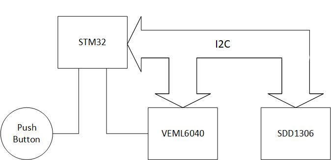
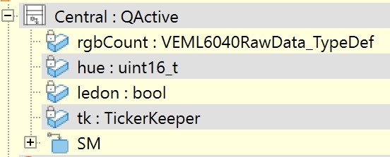
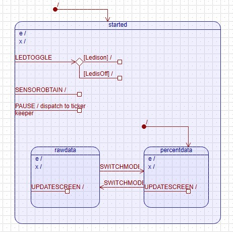
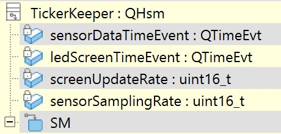
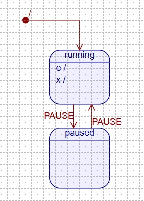
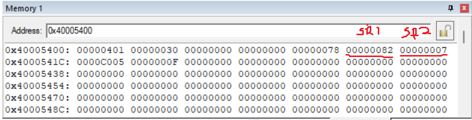
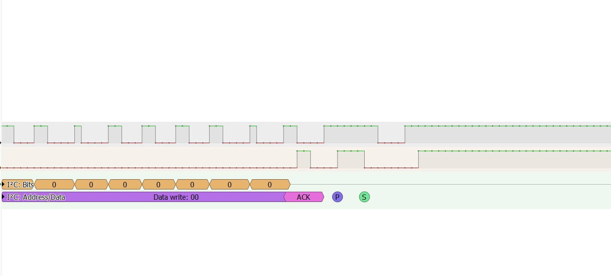

# Colour Diffusal (Reader)
## Components
- Components:
- Microcontroller: Weact STM32F411CEU6 Black Pill
- Peripherals: Push button, WAVGAT OLED 0.96 inch I2C YB SDD1306, PiicoDev Colour Sensor VEML6040
- Electrical components: Breadboard + power supply, Hook up wires, resistors (4.7k(2), 10k)

## Software and framework used
- QP event driven framework running on uC/OS-ii port
- QM modelling tool.

## State machines
### Central active object
 

### TickerKeeper state machine
 

- Concept used:
 1)Ultimate hook to group events common to both modes such as events to toggle led, get sensor readings and pause 
 
 2)Reminder to trigger updating of screen caused by entry to modes or by time events
 
 3)Orthogonal Component to realise the pausing mechanism, this is done by having the Central active object to hold a state machine called TickerKeeper as a component

Youtube video demo

## Function
1)Press small button to switch between RGB reading in percentages or raw data

2)Press button one to toggle bright LED came with the colour sensor

3)Press button two to pause the updating of the screen and readings, while still allowing the other two functions (toggle bright LED and switch between modes) to happen when triggered.

## BUGS
### I2C BUG
Sometimes after CR1_START is set and start bit is seen physically sent (EV5 finished), but the program gets stucked waiting for SR1_ADDR or SR1_AF (waiting for 
EV6 to happen)

This happens particulary during the switch of RGB reading in raw data to percentages or vice versa 

Below are the I2C registers at EV6(just after ADDR is set) when the program is behaving correctly

However when the bug happens, SR1 and SR2 are both zero (I didnt screenshot registers when it happened), DR register holds the correct address of the pheripheral (0x3C<<1) and SR1_SB is cleared (EV5 happens successfully)

Using logic analyser to see the signals when this happens show that start bit got sent, but the pheripheral address (should be sent next) is not sent, hence the program stucks waiting for EV6 to happen because ADDR never got set due to the chain effect of address is not shifted out by I2C.

At first I thought that it could be application issue but compiling with "DEBUG_CFG" config made the problem dissapear. Is the program running too fast (between clearing of the screen to starting to write screen for the other mode when small button is pressed) that I2C is not "stopped" properly? Adding the printf statement when compiling with debug setting allow for enough time for the I2C to "stop" properly for the next transaction?

I did a dirty fix of this by making the program to wait for SR2_BUSY to set after SR1_SB is set, then only write address to DR register (Basically wait for SR2_BUSY to set during EV5), this kinda fixed the issue and I have yet to see the bug happen again.

 